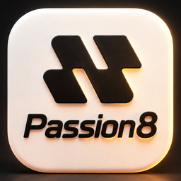
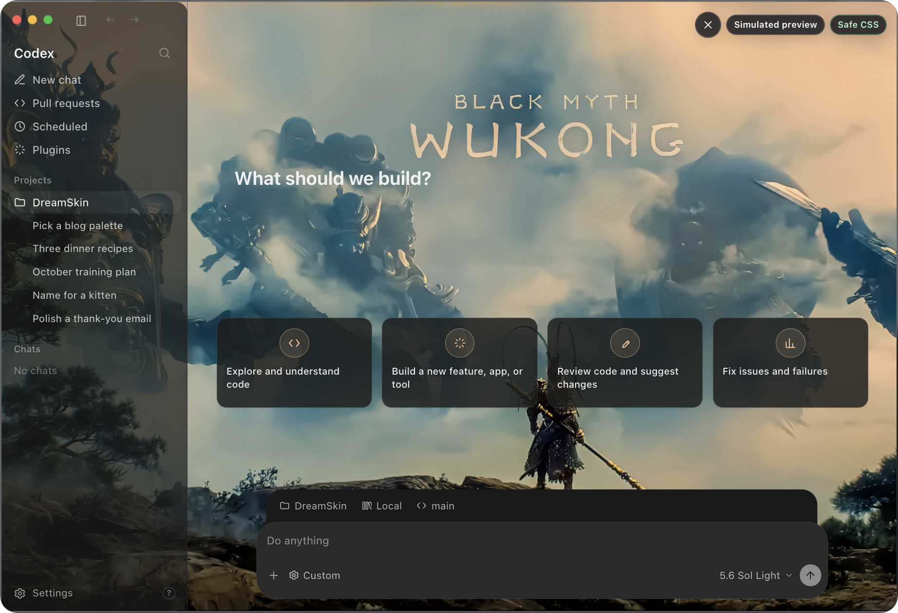
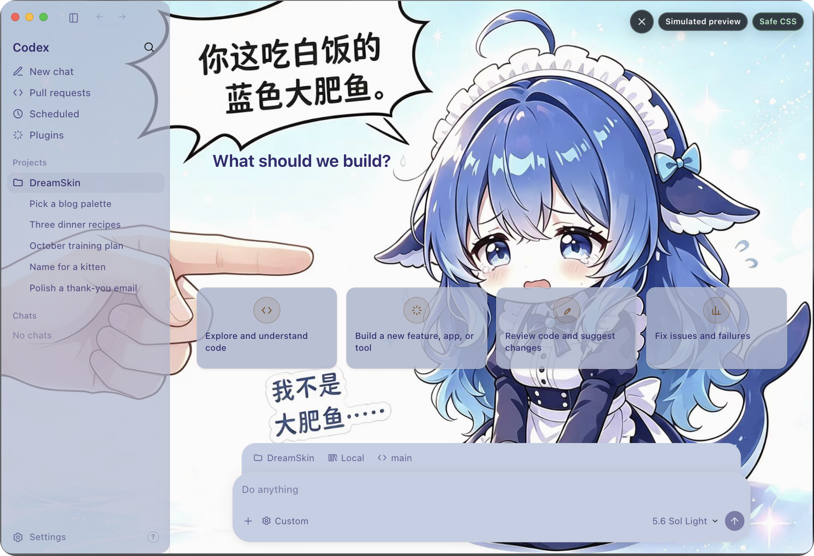
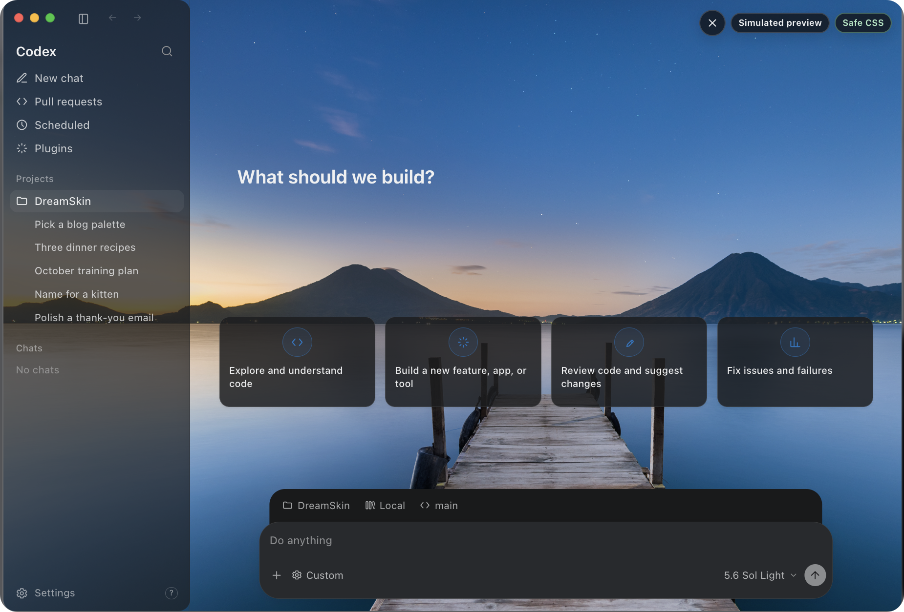
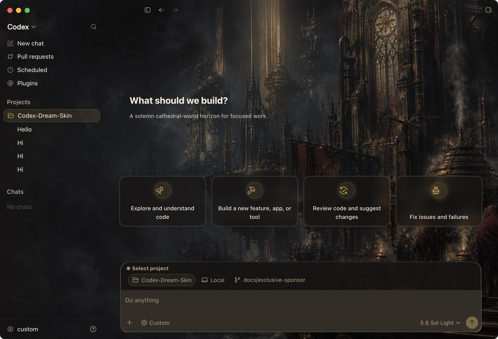
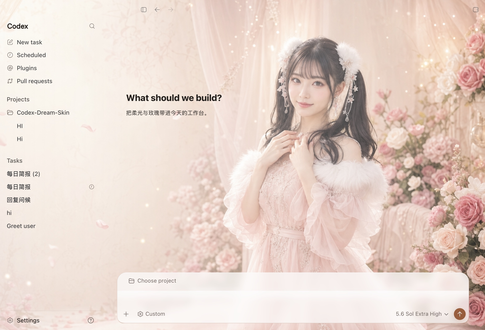
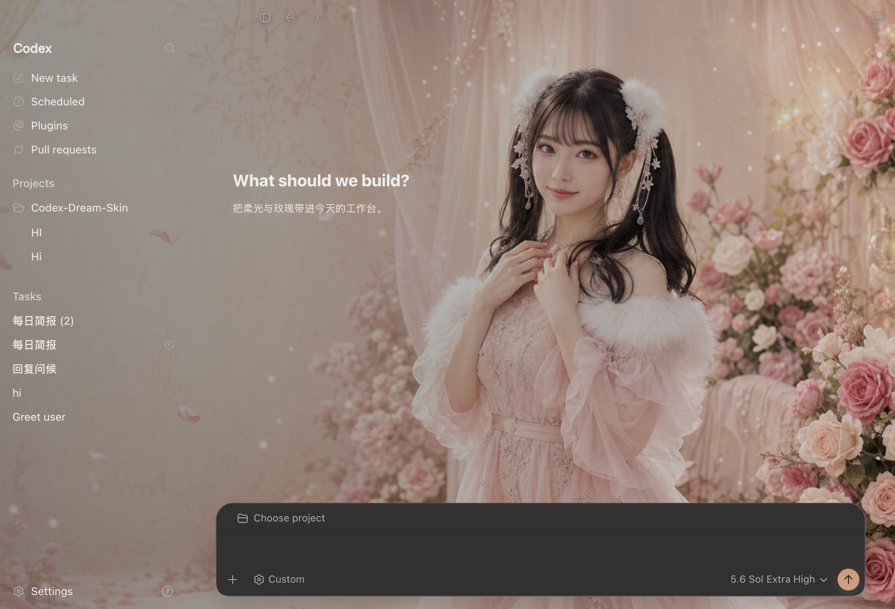

# Codex Dream Skin

### Give the Codex desktop app a face that breathes

**One image, one mood. Swap the wallpaper, keep every native control — sidebar, cards, project picker and composer stay real.**

English | [中文](README.zh-CN.md) | [Changelog](https://github.com/Fei-Away/Codex-Dream-Skin/releases)

**[Install](#install) · [Theme library](#theme-library--community) · [Features](#what-it-does) · [Import](#import-a-theme-zip) · [Developers](#for-developers) · [Safety](#safety)**

### 🌐 Official website & theme library: **[dreamskin.cc](https://dreamskin.cc)**

[Gallery](https://dreamskin.cc/gallery) · [Online Studio](https://dreamskin.cc/studio)

Unofficial. Does not modify `.app` / `app.asar` / WindowsApps.

## ❤️ Sponsor

<table>
<tr>
<td width="180">

</td>
<td>
Thanks to Passion8 for being this project's exclusive sponsor! Passion8 is an AI API relay for developers, giving individuals and teams stable, low-cost access to mainstream large models.  
<strong>Full-power AI, within reach</strong>: the full OpenAI and Claude lineups, original models, no silent downgrades and no wrapper shells; frontier models for a fraction of official pricing, with top-ups at 1:1 — <strong>$1 = ¥1</strong>. Keep your official SDK and point the base URL at Passion8: Claude Code, Codex, Grok, and any OpenAI-compatible client just work — one line of config, no code changes.
<strong>Global edge acceleration</strong>: Cloudflare's global edge plus multi-route BBR acceleration for low latency and high availability; 7×24 relay, 99.9% SLA, sub-second TTFT target.
<strong>Secure by default</strong>: isolated API keys, encrypted key storage, and HTTPS end to end — privacy first.  
Passion8 has a benefit for this project's users: register through <a href="https://passion8.cc/sign-up?aff=ZgLT">this link</a> and your first top-up earns an automatic 10% bonus — no application needed, credited within 30 minutes. Questions go to <a href="mailto:support@passion8.cc">support@passion8.cc</a>.
</td>
</tr>
</table>

Theme install and API config stay separate — this project never rewrites your provider settings.

## Install

Install the official Codex / ChatGPT app once and quit it, then download the package for your platform from [GitHub Releases](https://github.com/Fei-Away/Codex-Dream-Skin/releases):

| Platform | Download | First-run guide |
|---|---|---|
| macOS · Apple Silicon / Intel | `CodexDreamSkin-vX.Y.Z.dmg` | [`docs/install-macos.md`](./docs/install-macos.md) |
| Windows · x64 | `CodexDreamSkin-Setup-vX.Y.Z.exe` | [`docs/install-windows.md`](./docs/install-windows.md) |

No source checkout, Node.js install, `.sh` or `.ps1` command is required. After installation, use the macOS menu bar or the Windows system tray. Updates are manual: install the new package over the existing one and your themes and images are preserved. Because the public packages are unsigned, a new download may show a one-time OS security warning — the guides cover the safe GUI approval path, updates and uninstall steps.

## Theme library & community

  

  <strong>DreamSkin.cc</strong> · the official theme library and authoring platform 
  Make your workspace <em>yours.</em>

  <a href="https://dreamskin.cc/gallery"><strong>Browse the Gallery →</strong></a>
  &nbsp;·&nbsp;
  <a href="https://dreamskin.cc/studio"><strong>Online Studio →</strong></a>

- [**Gallery**](https://dreamskin.cc/gallery) — browse reviewed community themes with recent/popular sorting and creator rankings. Try any theme on in the in-page desktop simulator before you install it.

<table align="center">
  <tr>
    <td align="center">
       
      悟空（WUKONG） by JamesOpsLab
    </td>
    <td align="center">
       
      DeepSeek-鲸鱼娘 by powerdog996
    </td>
  </tr>
</table>

- [**Online Studio**](https://dreamskin.cc/studio) — swap the background, tune theme colors, and write Safe CSS in the browser, then export a `.zip` pack or submit it to the library (sign-in required; published after human review).

  
   
  Online Studio · swap in a background you like, dial in the focal point and palette — now it's your theme

The macOS menu bar and Windows tray both link straight to **Gallery** and **Online Studio**. For background transparency and deleting local themes, see [theme management](./docs/theme-management.md).

<strong>One-click apply</strong> — install a theme from DreamSkin.cc without downloading and importing it by hand

Found a theme you like on DreamSkin.cc? **Apply** hands it to the local client directly. Requires client v1.5.0 or newer (v1.5.5+ recommended).

Flow and safety boundary:

- The page invokes the local app through `dreamskin://apply?version=ver_...`. The link can carry exactly one theme version ID — **never** an arbitrary URL, file path, or command — and there is no silent-apply parameter.
- The app fetches the package only from the fixed official API, and refuses redirects.
- A native confirmation appears first, and the app checks the version's review status, apply-compatibility flag, version, package size, actually downloaded byte count, and SHA-256.
- It then reuses exactly the same ZIP, manifest, image, and Safe CSS validation as a manual import.
- Success requires the real renderer to report the new theme as rendered. On a launch or render failure the app tries to restore the previous theme, and the restore is itself visibility-verified; if it cannot confirm either state it reports the status as unconfirmed rather than claiming a rollback.

Only themes that fully satisfy the current pack contract (background image + `theme.json` + non-empty `theme.css` + declared `safe-css` capability) show the one-click button. Anything else goes through the manual import below.

## What it does

| Feature | |
|---|---|
| **Real UI** | Sidebar, cards, project picker and input stay native. Not a fake full-window screenshot. |
| **Continuous wallpaper** | One 16:9 image spans the full window; adaptive focus, safe-area and route treatment keep native content readable. |
| **Swappable art** | Drop in a UI-free image you like and it becomes your theme. |
| **Saved themes** | Switch local themes from the macOS menu bar or Windows system tray. |
| **One-click apply** | Hit apply on [DreamSkin.cc](https://dreamskin.cc); the client verifies origin and checksum, then installs it. |
| **Theme ZIP import** | Pick an ordinary `.zip` on either platform and add a validated pack to the local library. |
| **Restorable** | One-click restore to the stock look. |
| **Safer path** | Local-loopback CDP inject only. No official binary or signature changes. |

## Tested featured presets

### Gothic Void Crusade / 哥特虚空远征

**Special thanks to [@seansong-ideogram](https://github.com/seansong-ideogram) for designing and contributing this striking, atmospheric original gothic science-fiction work to the community.** It leads the tested featured presets and is the default theme for fresh macOS installs.

   
  Real injected Codex home screen (preview only)

After installing on macOS, switch directly from **Saved Themes** in the menu bar.

### Arina Hashimoto / 桥本有菜

Verified on the real Codex home screen in both light and dark appearances. The user-provided source PNG is `1672 × 941`; the preset's `2560 × 1440` JPEG is a standardized derived export that preserves the source's near-16:9 composition and does not add source detail. The sidebar, cards, project picker and composer shown below are native Codex controls.

   
  Light · real injected screenshot; unsent input hidden during capture (preview only)
    
   
  Dark · real injected screenshot; unsent input hidden during capture (preview only)

This portrait material remains in the source repository for reference and rights review; it is excluded from public DMG and `Setup.exe` assets. Public installers seed only the redistributable Gothic Void Crusade preset. Users can still choose **Change Background** to import UI-free artwork they are entitled to use and save it for one-click switching.

> The downloadable user source is [`docs/images/presets/arina-hashimoto-source.png`](./docs/images/presets/arina-hashimoto-source.png) (`1672 × 941`); the source-only reference preset uses the normalized derived [`background.jpg`](./macos/presets/preset-arina-hashimoto/background.jpg) (`2560 × 1440`). **Do not import either screenshot above** — they contain real UI and are previews only. The background is a user-provided AI-generated example, not an official OpenAI/Codex visual or endorsement; do not put it in a public installer without confirmed likeness and asset rights.

## Import a theme ZIP

For themes from DreamSkin.cc, prefer [one-click apply](#theme-library--community). The manual path below is the fallback, and covers packs from any other source.

<strong>Read the full import contract</strong> — accepted formats, validation and limits

Choose **Import Theme ZIP…** from the macOS menu bar app or the Windows tray. Only ordinary `.zip` files are accepted; the legacy `.dreamskin` extension is not supported, and renaming the suffix is not a supported migration path.

An official Studio pack contains `manifest.json`, `theme.json`, `theme.css` and exactly one `background.webp|jpg|png`, plus optional `LICENSE.txt` and the reserved `manifest.sig`. Put these files at the ZIP root or inside exactly one top-level theme folder. The importer verifies platform and minimum-client compatibility plus every declared payload file's byte length and SHA-256. `theme.css` must pass the local Safe CSS validator and can affect only the 12 registered parts; it is revalidated on every import and apply. `manifest.sig` is not used for signature verification.

The local simplified ZIP must contain exactly non-empty `theme.json`, non-empty `theme.css`, and its referenced image. That format has no official manifest integrity or compatibility declaration and should come from a trusted source. Limits are 32 MiB per archive, 32 entries, and 64 MiB expanded.

Import adds the pack to **Saved Themes** without changing the active theme. Identical content is not duplicated. A newer pack with the same ID updates the saved theme in place after the old directory identity is confirmed, and only legacy `-2`/`-3` directories with an identical semantic fingerprint are cleaned up. If the existing directory identity cannot be confirmed, import fails closed instead of overwriting it; names alone are never used to delete another theme.

**Manual fallback** — extract the archive and move the complete directory containing `theme.json`, `theme.css` and its image into the saved-theme folder:

- macOS: `~/Library/Application Support/CodexDreamSkinStudio/themes/`
- Windows: `%LOCALAPPDATA%\CodexDreamSkin\themes\`

Both controls include **Open Themes Folder**. Reopen the menu/tray after moving the directory. Do not add another wrapper level, links, nested archives, or an image-only folder without `theme.json`. Manual placement bypasses the ZIP importer's archive checks, so use trusted content only.

## For developers

Platform scripts are ready — different plumbing, same goal: theme Codex.

| Platform | Directory | Entry point |
|---|---|---|
| Apple Silicon / Intel Mac | [`macos/`](./macos/) | Double-click `Install Codex Dream Skin.command` |
| Windows | [`windows/`](./windows/) | `scripts/install-dream-skin.ps1` → `start-dream-skin.ps1` |

- Mac: [`macos/README.md`](./macos/README.md) · Windows: [`windows/README.md`](./windows/README.md) · [Windows EN](./windows/README.en.md)
- Paths and capability matrix: [`docs/platforms.md`](./docs/platforms.md)
- Copy-ready background prompt guide: [`docs/reference-background-prompt-guide.en.md`](./docs/reference-background-prompt-guide.en.md) · eight concept breakdowns: [`docs/background-generation-prompts.md`](./docs/background-generation-prompts.md)
- Project notes: [`docs/PROJECT.md`](./docs/PROJECT.md)

## Feedback & contributions

- **Issues** — use the [issue templates](./.github/ISSUE_TEMPLATE/) (bug / feature); blank issues are disabled. Please run the Verify / Restore self-checks before filing a bug.
- **PRs** — follow the [PR template](./.github/pull_request_template.md), describe the change, and tick the self-checks you actually ran (e.g. `macos/tests/run-tests.sh`, verify / restore).

## Safety

- CDP binds `127.0.0.1` only, but it has **no authentication**; another process on the same computer may still connect and inspect or control the renderer.
- Pausing the theme or stopping only the injector does not close the debug port of an already running Codex process. Use a full Restore/restart, or quit every Codex process and reopen the official app normally, to end the exposure window.
- Does not touch the official install directory or code signature.
- **Never** rewrites API Key / Base URL; relay and theme stay separate.
- See [`SECURITY.md`](./SECURITY.md) for the complete threat model and operating guidance.

## License

- [`macos/LICENSE`](./macos/LICENSE) (MIT) and [`macos/NOTICE.md`](./macos/NOTICE.md)
- Unofficial; Codex and related rights belong to their owners.
- People / IP material in bundled presets and previews is illustrative only — clear likeness, asset and trademark rights before commercial redistribution.

---

Star it, pick a look, and make Codex yours for today.
